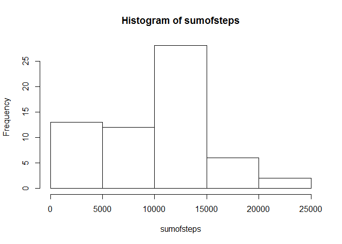
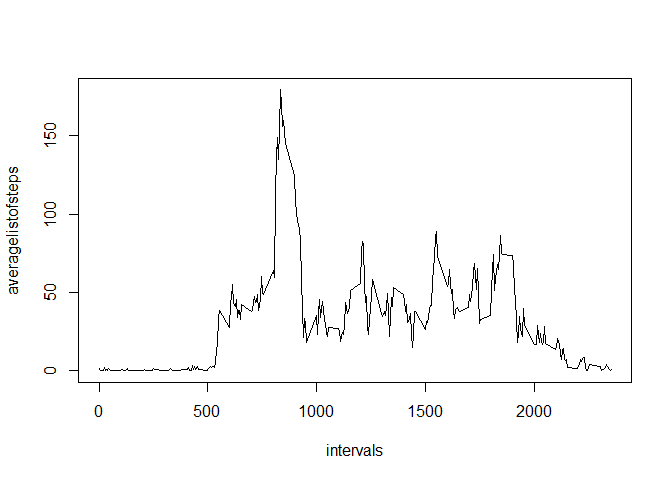
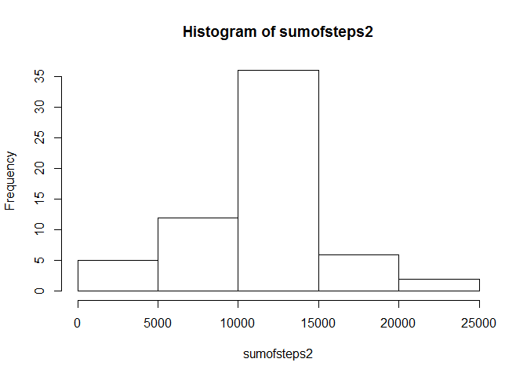
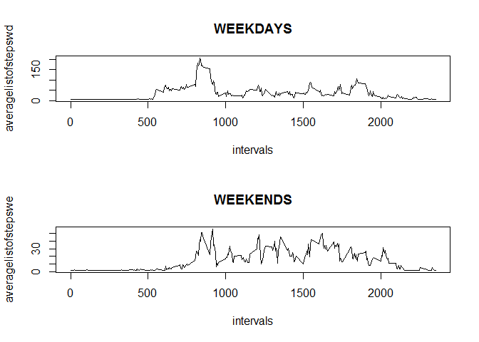

# Reproducible Research: Peer Assessment 1


## Loading and preprocessing the data

```r
dat <- read.csv("activity.csv")
datv <- as.Date(dat$date)
dayofweek <- weekdays(datv)
dat$date2 <- datv
dat$dayofweek <- dayofweek
listofdays <- split(dat, dat$date)
listofstepsbyday <- lapply(listofdays, `[`, 1)
```
Now some more stuff


## What is mean total number of steps taken per day?

```r
sumofsteps <- sapply(listofstepsbyday,sum, na.rm =TRUE)
hist(sumofsteps)
```

 

```r
mean(sumofsteps)
```

```
## [1] 9354.23
```

```r
median(sumofsteps)
```

```
## [1] 10395
```
So, the mean number of steps is 9354.23  
and the median is 10395  

## What is the average daily activity pattern?

```r
dat$levels <- as.factor(dat$interval)
stepsbyinterval <- split(dat, dat$levels)
listofstepsbyinterval <- lapply(stepsbyinterval, `[`, 1)
sumoflistofsteps <- sapply(listofstepsbyinterval,sum, na.rm =TRUE)
intervals <- unique(dat$interval)
averagelistofsteps <- sumoflistofsteps/61.0
plot(intervals, averagelistofsteps, type = "l")
```

 

```r
which.max(averagelistofsteps)
```

```
## 835 
## 104
```


So, on average, the maximum number of steps taken   are usually sometime in the morning, at about 835 am


## Inputing missing values
now for missing values

```r
sum(!complete.cases(dat))
```

```
## [1] 2304
```

```r
dat2 <- dat
dat2$steps[is.na(dat2$steps)] <- floor(mean(dat$steps, na.rm = TRUE))
```
So we have 2304 time intervals with missing values but not anymore, we have replaced with the integer mean number of steps


```r
sum(!complete.cases(dat2))
```

```
## [1] 0
```

```r
listofdays2 <- split(dat2, dat2$date)
listofstepsbyday2 <- lapply(listofdays2, `[`, 1)
sumofsteps2 <- sapply(listofstepsbyday2,sum, na.rm =TRUE)
hist(sumofsteps2)
```

 

```r
mean(sumofsteps2)
```

```
## [1] 10751.74
```

```r
median(sumofsteps2)
```

```
## [1] 10656
```
We find that both the mean and median have slightly gone up after replacing the missing values.
  
now for weekday vs weekend analysis


## Are there differences in activity patterns between weekdays and weekends?


```r
dat2$whatday <- "weekday"
for (i in 1:nrow(dat2)) { 
  if(dat2$dayofweek[i] == "Sunday") {
    dat2$whatday[i] <- "weekend"
  }
}

for (i in 1:nrow(dat2)) { 
  if(dat2$dayofweek[i] == "Saturday") {
    dat2$whatday[i] <- "weekend"
  }
}

dat2$whatday <- as.factor(dat2$whatday)
x <- split(dat2, dat2$whatday)
weekdays <- x[1]
weekends <- x[2]
weekdays <- as.data.frame(weekdays)
weekends <- as.data.frame(weekends)

stepsbyintervalwd <- split(weekdays, weekdays$weekday.levels)
listofstepsbyintervalwd <- lapply(stepsbyintervalwd, `[`, 1)
sumoflistofstepswd <- sapply(listofstepsbyintervalwd,sum, na.rm =TRUE)
intervals <- unique(dat$interval)
averagelistofstepswd <- sumoflistofstepswd/45.0
stepsbyintervalwe <- split(weekends, weekends$weekend.levels)
listofstepsbyintervalwe <- lapply(stepsbyintervalwe, `[`, 1)
sumoflistofstepswe <- sapply(listofstepsbyintervalwe,sum, na.rm =TRUE)
intervals <- unique(dat$interval)
averagelistofstepswe <- sumoflistofstepswe/45.0

par(mfrow=c(2,1))
plot(intervals, averagelistofstepswd, type = "l")
title(main = "WEEKDAYS")
plot(intervals, averagelistofstepswe, type = "l")
title(main = "WEEKENDS")
```

 

So, as we can see from the graphs, the weekend steps seem to be more evenly distributed throughout the day.

Thats all, folks!!


